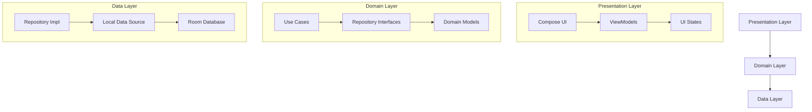

# Expense Tracker

A modern Android expense tracking application built with Jetpack Compose and Material Design 3, following clean architecture principles and best practices.


## Features 🚀

- **Material Design 3**: Modern UI with dynamic color theming and beautiful animations
- **Category Management**: Smart categorization with intuitive icons and color coding
- **Real-time Updates**: Instant expense tracking and category filtering
- **Offline Support**: Full functionality without internet connection
- **Data Backup**: Automatic cloud backup integration
- **Detailed Analytics**: Visual representation of spending patterns
- **Clean Architecture**: Separation of concerns for better maintainability
- **Comprehensive Testing**: Unit tests and UI tests for reliability

## Architecture 🏗️

The app follows Clean Architecture principles and is organized into three layers:



### Tech Stack 📚

- **UI Layer**
    - Jetpack Compose
    - Material Design 3
    - Compose Navigation
    - ViewModel
    - Kotlin Coroutines Flow

- **Domain Layer**
    - Clean Architecture Use Cases
    - Repository Pattern
    - Kotlin Coroutines

- **Data Layer**
    - Room Database
    - DataStore Preferences
    - Repository Implementation

### Dependencies 📦

- **UI & Compose**
    - `androidx.compose.ui:ui`
    - `androidx.compose.material3:material3`
    - `androidx.navigation:navigation-compose`

- **Architecture Components**
    - `androidx.lifecycle:lifecycle-viewmodel-compose`
    - `androidx.room:room-runtime`
    - `androidx.datastore:datastore-preferences`

- **Dependency Injection**
    - `com.google.dagger:hilt-android`

- **Testing**
    - JUnit4
    - Mockk
    - Compose UI Testing
    - Espresso
    - Hilt Testing

## Testing Strategy 🧪

The app implements a comprehensive testing strategy:

1. **Unit Tests**
    - ViewModel Tests
    - Use Case Tests
    - Repository Tests
    - Utility Tests

2. **UI Tests**
    - Component Tests
    - Screen Navigation Tests
    - User Interaction Tests

3. **Integration Tests**
    - Repository Integration Tests
    - Database Integration Tests

## Code Quality 🎯

- **Static Analysis**: Integrated with ktlint and detekt
- **CI/CD**: Automated testing and deployment pipeline
- **Code Documentation**: Comprehensive KDoc documentation
- **Git Workflow**: Organized commit history and branching strategy

## Best Practices ✨

1. **Modern Android Development**
    - Jetpack Compose for UI
    - Kotlin Coroutines for async operations
    - StateFlow for reactive programming
    - Material Design 3 for modern UI

2. **Architecture**
    - Clean Architecture
    - MVVM pattern
    - Single Activity
    - Composable-first approach

3. **Performance**
    - Efficient database queries
    - Lazy loading of lists
    - Memory leak prevention
    - Background processing optimization

4. **Security**
    - Data encryption
    - Secure file storage
    - Privacy-focused design

## Getting Started 🚀

1. Clone the repository:
```bash
git clone https://github.com/yourusername/ExpenseTracker.git
```

2. Open in Android Studio Arctic Fox or later

3. Run the app:
```bash
./gradlew installDebug
```

4. Run tests:
```bash
./gradlew test            # Unit tests
./gradlew connectedCheck  # UI tests
```

## Contributing 🤝

1. Fork the repository
2. Create your feature branch (`git checkout -b feature/AmazingFeature`)
3. Commit your changes (`git commit -m 'Add some AmazingFeature'`)
4. Push to the branch (`git push origin feature/AmazingFeature`)
5. Open a Pull Request

## License 📄

This project is licensed under the MIT License - see the [LICENSE](LICENSE) file for details

## Acknowledgments 🙏

- Material Design 3 Guidelines
- Android Architecture Components
- Clean Architecture by Robert C. Martin
- Jetpack Compose Documentation

---

Made with ❤️ by Mahmood Ahmad Khan